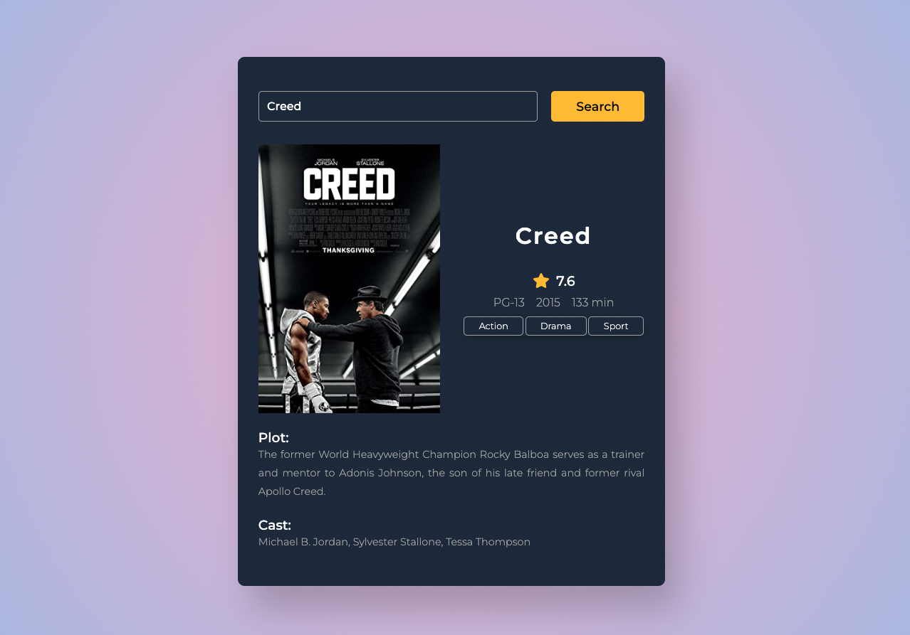

# Movie-Guide-App


<p>This is a simple web application that allows users to search for information about movies. The app uses the OMDb API to retrieve movie data, and displays it in a user-friendly way.</p>

<h3>Getting started</h3>

<p>To get started with the app, simply clone this repository and open the index.html file in your browser.</p>

```
git clone https://github.com/SejeelTauseef56/Movie-Guide-App.git cd movie-guide-app
```
<h3>Usage</h3>
<p>
Enter the name of a movie in the search bar and click the "Search" button.

The app will retrieve data from the OMDb API and display it in the result div.

If the movie is found in the database, the app will display its poster, title, rating, genre, release date, and a brief plot summary.

If the movie is not found in the database, the app will display an error message.</p>

<h3>Code structure</h3>
<p>
The app consists of three files:

index.html: The main HTML file that contains the search bar and result div.

style.css: The CSS file that defines the app's styling.

script.js: The JavaScript file that contains the code to retrieve data from the OMDb API and display it in the result div.</p>


